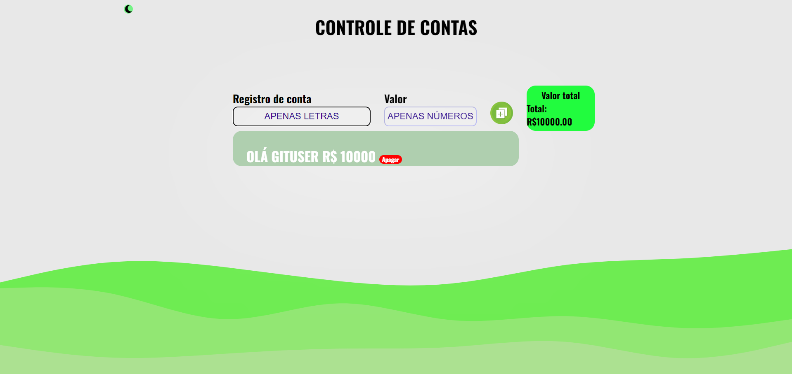
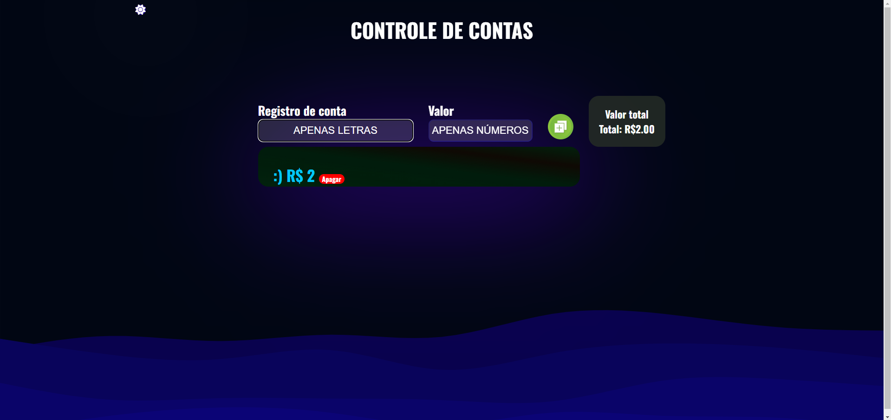

<h1><strong >Fala pessoal, beleza? Tudo na paz de Cristo?</strong></h1>

Vou explicar um pouco sobre as funcionalidades desta página. Esse projeto eu tive a ideia de criar do zero quando estava assistindo uma aula e fazendo uma funcionalidade para outro projeto do curso. Eu pensei: por que não criar um controle de contas?

Nesse projeto, eu aprendi muitas coisas novas, principalmente em JavaScript. A lógica usada é bem simples para facilitar a leitura do código.

<h1><strong >Versão 1</strong></h1>
Bom, o aplicativo está passando por mudanças significativas. Essa foi a primeira versão básica, onde o intuito era apenas "tirar da mente" o projeto em si.

<h1><strong >Versão 2</strong></h1>

Bom, na segunda versão, com o avanço dos estudos, o projeto foi mudado totalmente. Foi adicionado o "Modo Noturno" e alterado o código JavaScript para enviar as tarefas com "Enter", além de uma mudança imensa no código CSS para melhorar a visualização do usuário.

<h5><strong > "Modo dia"</strong></h5>

<h5><strong > "Modo noite"</strong></h5>

<h1><strong >Versão 3 </strong></h1>

<strong > "VERSÃO 3.0"</strong>

Design Responsivo: O design do aplicativo foi completamente repaginado para ser totalmente responsivo, oferecendo uma experiência consistente em todos os dispositivos, desde desktops até dispositivos móveis.

Aprimoramentos do Modo Escuro/Claro: Fiz ajustes na coloração e no contraste do modo escuro e claro.

Adoção de ES6 Modules: Estou  utilizando módulos ES6 (ECMAScript 6) em todo o  código JS. permitindo  organizar o código de forma mais modular e reutilizável, facilitando a manutenção e o desenvolvimento de funcionalidades dentro do página.

